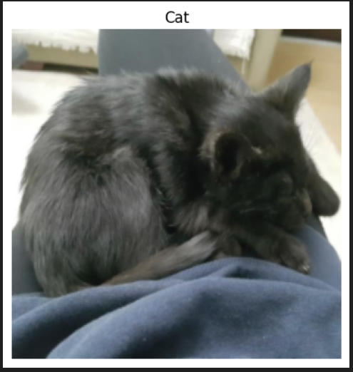

</img>

## Table of Contents

> [Vision Transformer - Pytorch](#vision-transformer---pytorch)

> [Install](#install)

> [Dataset preparation](#Dataset-preparation)

- [Image processors for resizing and converting image into tensor](#Resize_Tensorize)

- [Sample Visualisation](#Sample_Viz)

> [ViT components](#ViT-components)
- [Datasets and dataloaders](#Datasets-DataLoaders)


- [Patch embedding](#PatchEmbedding)
- [Positional Embedding](#Positional-Embedding)
- [Multihead Self-Attention Block](#MultiheadSelfAttentionBlock)
- [Multi-Layer Perceptron Block](#MLPBlock) 
- [Transformer Encoder Block](#TransformerEncoderBlock)
- [ViT assembled](#ViT)

## Vision Transformer - Pytorch

The Vision Transformer (ViT) marks a significant shift in how deep learning approaches image processing tasks, traditionally dominated by Convolutional Neural Networks (CNNs). ViT applies the transformer architecture, originally designed for natural language processing tasks, to image classification challenges. This innovative approach treats an image as a sequence of patches and processes these patches through a series of transformer blocks, leveraging self-attention mechanisms to understand the global context of an image.

Vision Transformers are built on tranformer architecture. So, in order to understand the mechanism of the original transformers architecture, please follow the link below
(https://images-segmmentation-prompt.readthedocs.io/fr/latest/Documentation/scripts/Architecture.html)

As for Vision transformers, the link below provides basic concepts behind Vision Transformers.
(https://images-segmmentation-prompt.readthedocs.io/fr/latest/Documentation/scripts/ViT.html)

 

## Install

The current Github repository provides ready-to-use packages with predefined requirements.

These packages contain:
> ViT principal components that are assembled afterwards to make fully working Visual Transformer architecture:
- Datasets and dataloaders
- Image processors for resizing and converting image into tensor
- Sample Visualisation
- Patch embedding
- Multihead Self-Attention Block
- Multi-Layer Perceptron Block
- Transformer Encoder Block
- ViT Assembled

- Utility modules (training, testing, calculating performance indicators, ploting ... )

Please refer to the requirements.txt file for a list of necessary dependencies.

> Installing packages

```python
!pip install git+https://github.com/MasrourTawfik/images_segmentation_prompt/tree/main/ViT_Implementation.git
```
> Setting Up the Computational Environment

The code below checks for the PyTorch version and whether CUDA is available for GPU computation.
- CUDA: A programming model and platform by NVIDIA for running software on GPUs, enabling increases in performance with parallel computing. CUDA/GPU (Graphics Processing Unit) excels at parallel processing, handling many operations simultaneously, making it faster for tasks like graphics rendering and scientific computations.

- CPU (Central Processing Unit) is designed for general-purpose computing, handling a wide range of tasks but at a slower pace.

```python
print(f'Using PyTorch version: {torch.__version__}')
device="cuda" if torch.cuda.is_available() else "cpu"
print(f'Using device: {device}')
```

## Dataset preparation
### Classification dataset
Dataset used should be arranged into separate folders, train and test folder, each one containing two folders named after the class label (for example: dataset used in the notebook attached to the repo is divided into two folders with the name of cat and dog).

> Setting up the path on Google Colab

```python
from google.colab import drive
drive.mount('/content/gdrive', force_remount=True)
!cp /content/gdrive/MyDrive/ViT_test/DogsCats.zip /content

os.makedirs('data', exist_ok=True)

!unzip -q DogsCats.zip -d /content/data

# Setup directory paths to train and test images
train_dir = '/content/data/DogsCats/train'
test_dir = '/content/data/DogsCats/test'
```

> Setting up locally
```python
# Setup directory paths to train and test images
train_dir = r'folder_name\train'
test_dir = r'folder_name\test'
```

### Datasets_DataLoaders
Handles data loading and batching, making it easier to feed data into the model for training.
- Datasets: Allows you to organize your data in a way that is ready for analysis or model training
- Dataloader in PyTorch simplify the process of feeding batches of data into a model for training or inference.
>Use ImageFolder to create dataset(s)
```python
train_data = datasets.ImageFolder(train_dir, transform=transform)
test_data = datasets.ImageFolder(test_dir, transform=transform)
```
> Get class names from folders
```python
class_names = train_data.classes
```
### Resize_Tensorize

Provides functionality for resizing and converting images into tensors, preparing them for processing by neural networks.
Suitable parameters as cited in related paper An Image is Worth 16x16 Words: Transformers for Image Recognition at Scale are:
- Size 224x224
- Patch size = 16

This process can be simply done by these lines of code
Please refer to the class for more details
```python
transformer=Resize_Tensorize()
transform=transformer.create_transforms()
```

### Sample_Viz
Enables visualizing samples from the dataset, to help checking if data was properly loaded or not
```python
sample_viz=Sample_Viz()
sample_viz.visualize_sample(train_dataloader, class_names)
```
The output would be a random image from dataset plotted with class name above it.

</img>

### set_seed
A utility script for setting the random seed to ensure reproducibility of results.


## ViT components

### PatchEmbedding
Handles the creation of patch embeddings from input images, which is a crucial preprocessing step in Vision Transformer models where images are divided into patches and then projected into an embedding space.

> In this class we will turn image into patches and flattened the patches (from 2D to 1D vector)

- Reminder: Please refer to documentation for more detailed explanation


> Class initialization

- Each image contain 3 Channels RGB (Red, Green, Blue)
- Patch size is equal to 16x16
- Embedding dimension chosen for each patch flattened (1D) vector is 16x16x3=768

```python
def __init__(self,
                 in_channels:int=3, #RGB
                 patch_size:int=16,
                 embedding_dim:int=768):  # for each patch 16x16x3=768 every patch has 768
```
- the nn.Conv2d() function creates kernels (patches) with defined size to get the patches with the desired size (16x16).

- stride is used to prevent overlapping of patches, this is why it is the same size as the patch size
```python
        # Create a convolution 2D layer to turn an image into patches
        self.patcher = nn.Conv2d(in_channels=in_channels,
                                 out_channels=embedding_dim,
                                 kernel_size=patch_size,
                                 stride=patch_size,
                                 padding=0)
```
To flatten the patches, we use a flatten layer imported from pytorch
- start_dim=2: This indicates the start dimension from which the flattening should begin. The dimension 0 is typically the batch size, and dimension 1 could be the channels. Starting the flattening at dimension 2 means you're keeping the batch size and channel information intact, and only the spatial dimensions (height and width of feature maps) are flattened.

- end_dim=3: This parameter specifies the end dimension up to which flattening should occur. Since in this case it's set to 3, and considering tensors are 0-indexed, this means that the flattening will include dimensions 2 and 3, which correspond to the spatial dimensions.


```python
        # Create a layer to flatten the patch feature maps into a single dimension
        self.flatten = nn.Flatten(start_dim=2, # only flatten the feature map dimensions into a single vector
                                  end_dim=3)
```
Finally, comes the forward function that helps get the final output format. The forward method is a critical component of a neural network model defined using PyTorch. It specifies how data passes through the network.

- Input Shape: The first step in the forward method is to ensure that the input tensor x is of the correct shape for processing. It checks that the resolution of the input image is divisible by the patch_size defined in the model. If the image size is not divisible by the patch size, the model cannot correctly apply its convolution operation as intended.

- Patching the Input: The input tensor x is then processed by the patcher, which is a convolutional layer (defined previously as nn.Conv2d) configured to extract patches from the input image and encode them into a higher-dimensional space.

Flattening the Output: The output from the patcher is then flattened using the flatten operation defined previously. This step transforms the multi-dimensional output of the convolutional layer into a 2D tensor, where one dimension is the batch size, and the other is a flattened vector representing the feature data of the patches.

- Adjusting Output Shape: Adjusting the shape of the flattened output using permute(0, 2, 1). This reordering is performed to ensure that the embedding dimension is the final dimension in the output tensor. Specifically, it changes the order of the output tensor dimensions to place the feature embeddings of the patches (the depth of the convolutional output) as the last dimension.

The notation [batch_size, P^2•C, N] -> [batch_size, N, P^2•C] in the comment explains the transformation of the tensor shape through the permute operation, where P^2•C represents the total number of features per patch (with P^2 being the elements in a patch and C being the number of channels), and N is the number of patches. This reordering is crucial for ensuring that data is correctly structured for whatever processing or analysis follows in the model.
```python
    # 5. Define the forward method
    def forward(self, x):
        # Create assertion to check that inputs are the correct shape
        image_resolution = x.shape[-1]
        assert image_resolution % self.patch_size == 0, f"Input image size must be divisble by patch size, image shape: {image_resolution}, patch size: {self.patch_size}"

        # Perform the forward pass
        x_patched = self.patcher(x)
        x_flattened = self.flatten(x_patched)

        # 6. Make sure the output shape has the right order
        return x_flattened.permute(0, 2, 1) # adjust so the embedding is on the final dimension [batch_size, P^2•C, N] -> [batch_size, N, P^2•C]
```


### Positional Embedding

> Class Embedding
- The class embedding is a special embedding that represents the "class" or "category" information of the input sequence. In the context of transformers used for tasks like image classification, this embedding serves as a placeholder for the overall representation of the input image that the model predicts. (cat 0 and dog 1)
- Implementation: It's initialized with random values and is learnable, meaning it gets updated during the training process. This embedding is added to the front of the sequence of patch embeddings, effectively becoming the first token of the sequence that the transformer processes. 

> Position Embedding
- Purpose: Position embeddings are used to give the model information about the order or position of the elements in the sequence. Unlike RNNs or CNNs, transformers do not inherently process data in order, so position embeddings are necessary to provide this contextual information.
- Implementation: Like the class embedding, position embeddings are also learnable and initialized with random values. Each position in the sequence has its own embedding, allowing the model to understand the sequence's structure and how different parts relate to each other.

Both embeddings are crucial for the transformer's ability to understand the data it's processing. 

```python
        # Create learnable class embedding (needs to go at front of sequence of patch embeddings)
        self.class_embedding = nn.Parameter(data=torch.randn(1, 1, embedding_dim),
                                            requires_grad=True)

        # Create learnable position embedding
        self.position_embedding = nn.Parameter(data=torch.randn(1, self.num_patches+1, embedding_dim),
                                               requires_grad=True)
```

### MultiheadSelfAttentionBlock
Implements the multi-head self-attention mechanism, a core component of the Transformerdesigned to apply multi-head self-attention to inputs, a mechanism that enables the model to weigh the importance of different parts of the input data when making predictions. 


- Initializing the multi-head self-attention block with specific hyperparameters. These include embedding_dim (the size of the input and output embeddings), num_heads (the number of attention heads), and attn_dropout (the dropout rate for the attention scores) to prevent overfitting.

- embedding_dim=768 and num_heads=12 are defaults inspired by the "base" configuration of the Vision Transformer, indicating a relatively large model size aimed at balancing performance and computational efficiency.
attn_dropout is set to 0 by default, indicating no dropout is applied on the attention weights, following the setup mentioned (though it's worth noting that dropout can be a useful regularization technique in preventing overfitting in many scenarios).

```python
def __init__(self,
                 embedding_dim:int=768, # Hidden size D from Table 1 for ViT-Base
                 num_heads:int=12, # Heads from Table 1 for ViT-Base
                 attn_dropout:float=0)
```

- Layer Normalization: Normalizes the input across features. This is commonly used in transformers to help stabilize the training process and improve convergence.
```python
self.layer_norm = nn.LayerNorm(normalized_shape=embedding_dim)
```
Multi-Head Attention Layer: The self.multihead_attn is the core of this block, enabling the model to focus on different parts of the input sequence for each attention head. This is critical for capturing various aspects of the input data.

- The batch_first=True argument indicates that the input tensors are expected to have a batch size as their first dimension, which aligns with common data formats in PyTorch.
```python
self.multihead_attn = nn.MultiheadAttention(embed_dim=embedding_dim,
                                                    num_heads=num_heads,
                                                    dropout=attn_dropout,
                                                    batch_first=True)
```

- Forward Method: The forward method defines how the input data x passes through the block:

- First, the input is normalized
- Then, the normalized input is passed to the multi-head attention layer (self.multihead_attn). Since this is self-attention, the query, key, and value are all the same tensor x. (Again please refer to our documentation on Transformers Architecture).
The attention layer returns two values: the attention output (attn_output) and the attention weights.


### MLPBlock
This block is designed to transform the input embeddings through a series of dense layers and nonlinear activations, in simple words, The MLPBlock is a part of a neural network that takes in some data and processes it to find patterns. 


> Initialization with Hyperparameters:

-embedding_dim: The size of the input and output embeddings. It matches the hidden size (D) from the Vision Transformer base configuration.
- mlp_size: The size of the hidden layer within the MLP. This is significantly larger than the embedding dimension, allowing the network to project the inputs into a higher-dimensional space where complex relationships can be learned.
- dropout: The dropout rate applied after each dense layer to prevent overfitting by randomly zeroing out some of the layer outputs during training.
- Layer Normalization (LN): The self.layer_norm normalizes the input across features for each data point in a batch, stabilizing the inputs to the MLP layers and speeding up convergence.

```python
    def __init__(self,
                 embedding_dim:int=768,
                 mlp_size:int=3072, 
                 dropout:float=0.1)
```

> Multilayer Perceptron (MLP) Layers:

- The MLP consists of a sequence of layers defined in nn.Sequential, starting with a linear layer that projects the input embeddings to a higher-dimensional space (mlp_size).
- The activation function on the output: nn.GELU() applies a Gaussian Error Linear Unit (GELU) nonlinearity, which is a smooth approximation to the ReLU function and to enable the model to capture more complexe patterns of the dataset.
```python
# 4. Create the Multilayer perceptron (MLP) layer(s)
        self.mlp = nn.Sequential(
            nn.Linear(in_features=embedding_dim,
                      out_features=mlp_size),
            nn.GELU(), # "The MLP contains two layers with a GELU non-linearity (section 3.1)."
            nn.Dropout(p=dropout),
            nn.Linear(in_features=mlp_size, # needs to take same in_features as out_features of layer above
                      out_features=embedding_dim), # take back to embedding_dim
            nn.Dropout(p=dropout) # "Dropout, when used, is applied after every dense layer.."
        )
```


> Forward Method: 
The forward method defines the data flow through the block:

- Inputs are first normalized using layer normalization.
- Then, they are passed through the MLP layers, where they undergo two linear transformations with a non-linear activation and dropout in between.

### TransformerEncoderBlock
Defines the Transformer Encoder Block, using the MLP block and Multihead attention block assembled together
```python
# 3. Create MSA block 
        self.msa_block = MultiheadSelfAttentionBlock(embedding_dim=embedding_dim,
                                                     num_heads=num_heads,
                                                     attn_dropout=attn_dropout)

        # 4. Create MLP block
        self.mlp_block =  MLPBlock(embedding_dim=embedding_dim,
                                   mlp_size=mlp_size,
                                   dropout=mlp_dropout)
```


### ViT
This is the main script for the Vision Transformer model, integrating all the components into a complete architecture for image classification or other vision tasks.